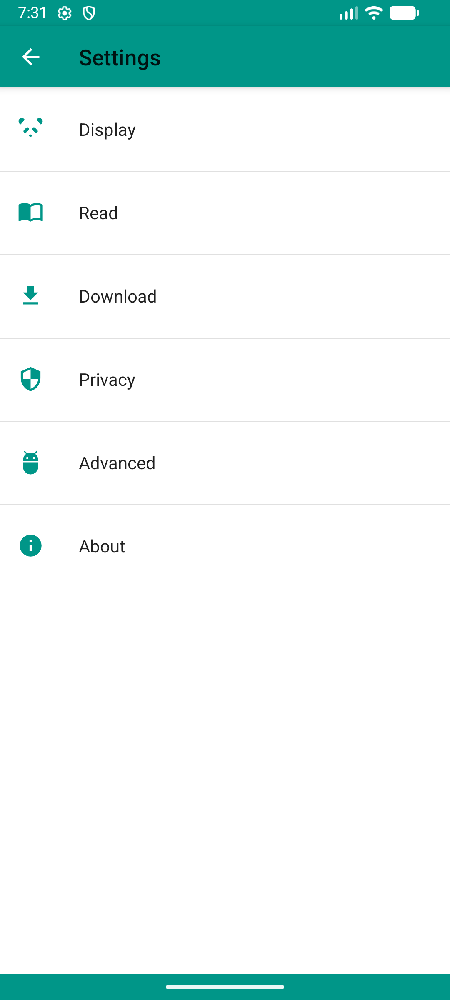

# [常见问题汇总](https://github.com/xiaojieonly/Ehviewer_CN_SXJ/blob/BiLi_PC_Gamer/feedauthor/EhviewerIssue.md)

# EhViewer

这是一个 E-Hentai Android 平台的浏览器。

An E-Hentai Application for Android.

# Download

点击前往下载：

[//]: # (- [Appteka]&#40;https://appteka.store/app/acdr168648&#41;)
- [百度云](https://pan.baidu.com/s/1hVYpBeA7WSrU7Y6314WrSw) 提取码：pdmt
- [夸克网盘](https://pan.quark.cn/s/4b81666facaf) 提取码：LwLk
- [蓝奏云](https://wwbfg.lanzouu.com/i4HWk3cmb5xc)，电脑端可正常下载 提取码：coat
- [GitHub](https://github.com/xiaojieonly/Ehviewer_CN_SXJ/releases)
- Torrent链接: magnet:?xt=urn:btih:30a9cbafcd80d3b102f03ccbb8ede39e77ea12d7&xt=urn:btmh:1220f0e3b378843bb2c77c148b4519d2531958b5998c0d6b49a609ab998de9cc3755&dn=EhViewer-2.0.0.9.apk&xl=23534115

点击前往赏饭：

- [要饭嘛不寒掺](https://github.com/xiaojieonly/Ehviewer_CN_SXJ/blob/BiLi_PC_Gamer/feedauthor/support.md)

唯一X账号：https://x.com/Sherloc21784244    
Telegram群: https://t.me/+WyclP8pPlk-JfbwS    
Telegram通知群: https://t.me/Ehviewer_xiaojieonly_channel

# Changelog

## 2025/12/01
### 新版发布2.0.0.9

- 修复界面更新相关的崩溃问题
- 添加Android 9图片解码失败时的回退机制
- 优化图片处理和渲染参数格式化
- 修复关闭种子下载对话框时可能发生的崩溃
- 修复归档下载器在某些情况下崩溃的问题
- 适配 Android 14 前台服务类型变更
- 增加对content URI方案下导入归档的支持
- 为下载列表添加按名称排序支持
- 同步德语、西班牙语、法语、韩语、泰语、日语和繁体中文翻译
- 修复版本更新时因空安全导致的崩溃
- nullcat*：add error detail for wrong igneous
- 应用程序启动时，异步删除三天前的解析错误日志文件。

## 2025/11/07
### 新版发布2.0.0.8

- 移除不再使用的 Firebase Crashlytics 导入。
- 在 EhDB 和 SpiderDen 中添加异常处理以避免应用崩溃。
- 增加在 TreeDocumentFile 中列出文件时的空值检查和异常处理。
- 为 WebViewSignInScene 中的 HTTP 响应添加默认的 reason phrase。
- 增强 GLRootView 中的 EGL 配置选择逻辑，增加备用方案以提高稳定性。
- 将 Analytics.java 迁移到 Kotlin。
- [百度云](https://pan.baidu.com/s/1c0bCCgfiTa4G9hwopSyAOw) 提取码：4vu2
- [蓝奏云](https://wwsu.lanzouu.com/iYYrU3adzm5e)，电脑端可正常下载 提取码：f6f0
- [GitHub](https://github.com/xiaojieonly/Ehviewer_CN_SXJ/releases)
- Torrent链接: magnet:?xt=urn:btih:002aea861f2af0bc84618bdf23acf5558ca1f665&xt=urn:btmh:1220648f8a4ad80b944ea1e9437d0021034205eb7c60b918a6f6d57bf36e47ecb247&dn=EhViewer-2.0.0.8.apk&xl=23456665

## 2025/11/01 
### 新版发布2.0.0.5

- 在悬浮工具烂中添加拖动切换按钮，只有开启时才允许进行拖动排序
- wyapx：use Analytics to manage all Firebase request (#2129)
- West-Pavilion：添加本地压缩包导入功能：下载->右上菜单->导入本地压缩包
  [//]: # (- [Appteka]&#40;https://appteka.store/app/acdr168648&#41;)
- [百度云](https://pan.baidu.com/s/1ocYZZ0j5gmb2KUkcJM1Wnw) 提取码：xem5
- [蓝奏云](https://wwsu.lanzouu.com/iPadd39veuyh)，电脑端可正常下载 提取码：en1v
- [GitHub](https://github.com/xiaojieonly/Ehviewer_CN_SXJ/releases)
- Torrent链接: magnet:?xt=urn:btih:2f123b5c605e8c8f487989049f8f00c6aa3ab169&xt=urn:btmh:122046c1e5bfa7fb7a5520e93be932576211d01b5760d8b1fc8081d48410e5e9e486&dn=EhViewer-2.0.0.5.apk&xl=23260086

## 2025/10/05 : 感谢nullcat的pr   
### 新版发布2.0.0.4    

- 修复下载列表排序功能在部分机型上会崩溃的问题    
- add samsung Air action support (#2119)    
- wrong direction on mouse scroll (#2130)    
- add auto dark mode (#2126)    
- [百度云](https://pan.baidu.com/s/1R_XrMkZEOpgEJpA_sR4cFw) 提取码：yf3w
- [蓝奏云](https://wwsu.lanzouu.com/ih0XT37rz82d)，电脑端可正常下载 提取码：h0mw
- [GitHub](https://github.com/xiaojieonly/Ehviewer_CN_SXJ/releases)
- Torrent链接: magnet:?xt=urn:btih:3aae02c07f1ac4f814c6583cc1074cbfb70dcda6&xt=urn:btmh:1220b3bf79110dc6daef678013a40c67492fc0cdf25460466b1a459f4479607127b0&dn=EhViewer-2.0.0.4.apk&xl=23252893

## 2025/09/15 :
### 新版发布2.0.0.2

- 修复了下载列表进行排序时UI状态出错的问题
- 修复了下载列表尝试排序时APP崩溃的问题
- [//]: # (- [Appteka]&#40;https://appteka.store/app/acdr168648&#41;)
- [百度云](https://pan.baidu.com/s/1qEUS4h1pEod8ifAHfsr3nA) 提取码：b2ga
- [蓝奏云](https://wwsu.lanzouu.com/iSuEi368n53e)，电脑端可正常下载 提取码：h2y4
- [GitHub](https://github.com/xiaojieonly/Ehviewer_CN_SXJ/releases)
- Torrent链接: magnet:?xt=urn:btih:0f49565ab29fc7ab76ea313ca014442f2e9b0167&xt=urn:btmh:1220526f3b0ea65b5704625394e9ff546047e104e737c90e333a35b83ae1dc1beb5f&dn=EhViewer-2.0.0.2.apk&xl=23252086

## 2025/09/01 : 
### 新版发布2.0.0.1

- 画廊名带“|”字符的都无法进行档案下载的问题
- 搜索栏搜索时自动去除换行符
- 千呼万唤始出来~下载列表添加排序功能，现在长按后即可拖动进行排序了
- [百度云](https://pan.baidu.com/s/1uyBwzbf1n_dO1L_zWCYJvA) 提取码：sy3c
- [蓝奏云](https://wwsu.lanzouu.com/iZB4g355985g)，电脑端可正常下载 提取码：ag8t
- [GitHub](https://github.com/xiaojieonly/Ehviewer_CN_SXJ/releases)
- Torrent链接: magnet:?xt=urn:btih:d297eb3575c9dd66b11fd1190da6de9ca99f13f4&xt=urn:btmh:1220bafa1275785022d096c4197f0b73c9d9302514841782dc155d4209967a2033e3&dn=EhViewer-2.0.0.1.apk&xl=23252182

## 2025/08/01 : 
### 新版发布1.9.9.17

- 修复了自定义host不生效的问题
- 修复了由画廊名称中的"/"字符引起的档案下载路径不正常的问题
- 删除左侧栏多余的每分钟愿力信息

[//]: # (- [Appteka]&#40;https://appteka.store/app/acdr168648&#41;)
- [百度云](https://pan.baidu.com/s/1Y1kvi1KDq6_GfJF5yc8XLA) 提取码：cr2b
- [蓝奏云](https://wwsu.lanzouu.com/isnFy32g5ywd)，电脑端可正常下载 提取码：b8yw
- [GitHub](https://github.com/xiaojieonly/Ehviewer_CN_SXJ/releases)
- Torrent链接: magnet:?xt=urn:btih:ffc84b0416595dbb44615ac78e19c20a94c09b81&xt=urn:btmh:1220dbfee3d96551598e89fb666c882cf4ce1bc130b4c6acad62a2ffec8f07514076&dn=EhViewer-1.9.9.17.apk&xl=23251522

## 2025/07/17 : host更新   
### 新版发布1.9.9.14

- 紧急更新表站host

[百度云](https://pan.baidu.com/s/1Vlc_g_Qi4N7ZamE-SRBbtg) 提取码：wykk  
[蓝奏云](https://wwsu.lanzouu.com/ihVy03195d7e)，电脑端可正常下载 提取码：87jv  
[GitHub](https://github.com/xiaojieonly/Ehviewer_CN_SXJ/releases)  
Torrent链接: magnet:?xt=urn:btih:b59ab1c119efb86acfa27b27124b5660d6478829&xt=urn:btmh:1220505d4be49eed6e78c0325378b10da01cd4dcdc0d657bad75edb8bf39bc28e006&dn=EhViewer-1.9.9.14.apk&xl=23251511

## 2025/07/01 : bkgs！！
### 新版发布1.9.9.13

- Update Japanese & fix typo
- update host
- 添加了评分显示开关（设置-EH-显示画廊评分）
- 修改了配额显示文本，现在未解锁单独配额的账号会显示‘ip基础限制’
- 修复了挂梯子时登录APP导致崩溃的问题

[//]: # (- [Appteka]&#40;https://appteka.store/app/acdr168648&#41;)
[百度云](https://pan.baidu.com/s/1_KGrPsuLkXGnSQdxcCn5yA) 提取码：mm56  
[蓝奏云](https://wwsu.lanzouu.com/i4W6U301y3gd) 提取码：9qjm  
[GitHub](https://github.com/xiaojieonly/Ehviewer_CN_SXJ/releases)  
Torrent链接: magnet:?xt=urn:btih:2a886cc0d6355dbe72e06fa4814ba32f383cc7a8&xt=urn:btmh:122042d5ba6460d3f60b04c975b01e994d748ab69091aa220ac17c3f1cee6d205672&dn=EhViewer-1.9.9.13.apk&xl=23251526  

## 2025/06/01 : 祝大家六一儿童节快乐~
### 新版发布1.9.9.12

- 适配了裸连状态下的网页登录功能  
[百度云](https://pan.baidu.com/s/1LPi9G8CLakBt3Ruzv3_a4Q?pwd=br2j) 提取码：br2j  
[蓝奏云](https://wwsu.lanzouu.com/iMWwX2xostbi) 提取码：axex  
[GitHub](https://github.com/xiaojieonly/Ehviewer_CN_SXJ/releases)  
Torrent链接: magnet:?xt=urn:btih:4d10ec4b0eb9f9c1f65a5e7617ab37f43a6f03f4&xt=urn:btmh:122033484646d900c4894fc026daddb1c032387ad184593ae7b8d448758b1346ff5b&dn=EhViewer-1.9.9.12.apk&xl=23244510
  
## 2025/05/04 : 祝大家54青年节快乐~ 
### 新版发布1.9.9.11
[百度云](https://pan.baidu.com/s/1Ur2ES2j41-udZ779JqYxkA?pwd=ucki) 提取码：ucki
[蓝奏云](https://wwsu.lanzouu.com/iiODe2vbjvaf) 提取码：gmbc
[GitHub](https://github.com/xiaojieonly/Ehviewer_CN_SXJ/releases)
- 种子下载成功后路径显示由单行显示改为多行显示 
- 下载成功的种子在重复下载时会直接跳转到成功弹窗
- 更新内置host
- 为书签栏和订阅栏添加了一个动画组件，来表示可通过点击切换，以降低用户学习成本
- 由于微软APP center即将停止运营，检查更新更改为，从Github获取更新信息，然后跳转到Github，由用户自行下载更新

## 2025/04/01 :
### 新版发布1.9.9.10

- 修复了因未开启硬件加速，导致头像渲染失败，从而导致APP崩溃的问题
- 修复了一些可能导致崩溃的问题
- gradle版本更新

[Appteka](https://appteka.store/app/acdr168648)
[百度云](https://pan.baidu.com/s/1myf_N-8l3IL4cuF_38u_dw) 提取码：3ftd
[蓝奏云](https://wwsu.lanzouu.com/iItRt2scxc0d) 提取码：7yxi
[GitHub](https://github.com/xiaojieonly/Ehviewer_CN_SXJ/releases)
Torrent链接: magnet:?xt=urn:btih:09b095aba750ad6d5ffc3a030d3901d098b61591&xt=urn:btmh:122029ddcece960b2b8638a7ffcd3384cd3f5e41cd4d9929203074900408d555101c&dn=EhViewer-1.9.9.10.apk

## 2025/03/01 : 
### 新版发布1.9.9.9

- 修复原图浏览时解析部分大图显示不全的问题
- 动图优化
- 修复收藏列表排序按钮现实场景出错的问题
- 为收藏列表添加了全选功能
- [Appteka](https://appteka.store/app/d52r213275)
- [百度云](https://pan.baidu.com/s/1AFJ-ZMx7sjg8GArG5GuawQ) 提取码：8jik
- [蓝奏云](https://wwsu.lanzouu.com/iXlQc2p6sx2h) 提取码：3bq2
- [GitHub](https://github.com/xiaojieonly/Ehviewer_CN_SXJ/releases)
- Torrent链接: magnet:?xt=urn:btih:c92339cb043af989dad4c464d47552b43119f9e2&xt=urn:btmh:1220e2fa66581a3120b3f7c0b874a044f264f85630181f210f7ac0753ce72052491d&dn=EhViewer-1.9.9.9.apk

## 2025/01/25 : 提前祝大家春节快乐
### 新版发布1.9.9.8

- 在标签长按弹窗中添加订阅和排除功能
- 由于微软APP center即将停止运营，检查更新更改为，从Github获取更新信息，然后跳转到Github，由用户自行下载更新
- clean up androidTest
- 删除了所有和APP center相关的代码，这是最后一版自动更新的版本

- [Appteka](https://appteka.store/app/11dr207588)
- [Microsoft App Center](https://install.appcenter.ms/users/xiaojieonly/apps/com.xjs.ehviewer/distribution_groups/let's%20roll)
- [百度云](https://pan.baidu.com/s/1bD8CNdtUf1UqyMWMhLidkQ) 提取码：r9pm
- [蓝奏云](https://wwsu.lanzouu.com/iGQw12ly703i) 密码:7b4s
- [GitHub](https://github.com/xiaojieonly/Ehviewer_CN_SXJ/releases)

## 2025/01/01 : 祝大家在2025年，身体健康，万事如意，长生不老，永远不死，打胶30分钟以上，越打越持久~  
### 新版发布1.9.9.7

- 为设置主页添加分割线  
- 修复设置页面切换主题时app奔溃的问题  
- 修复浏览画廊时全屏模式无法关闭的问题  
- gradle plugin更新  
- 删除锁定Cookie igneous功能，此功能已不适用于当前E站账号政策  
- 优化退出登录，现在退出登录会自动回到登录页  
- 修复‘配额’视图在特殊情况下无法正确显示的问题  

- [Appteka](https://appteka.store/app/9b1r203934)
- [Microsoft App Center](https://install.appcenter.ms/users/xiaojieonly/apps/com.xjs.ehviewer/distribution_groups/let's%20roll)
- [百度云](https://pan.baidu.com/s/1GV7ltodLNyZwxKulmi5laQ) 密码:vt1y
- [蓝奏云](https://wwsu.lanzouu.com/iOHZV2jlhjuj) 密码:4inm
- [GitHub](https://github.com/xiaojieonly/Ehviewer_CN_SXJ/releases)
- Torrent链接: magnet:?xt=urn:btih:e35ff0f430a28d4b72aac752dbca8fc35589f8fe&xt=urn:btmh:12202d5b6eafc1cbac6f729b4f9e6370b7274679447fa38746e8b295d58bc4dad7a6&dn=EhViewer-1.9.9.7.apk

## 2025/01/01 : 祝大家元旦快乐~

- [2024年更新日志-感谢大家的支持](feedauthor/year2024-thanks.md)  
- [2023年更新日志-时间过的好快](feedauthor/year2023-boom.md)  
- [2022年更新日志-成长](feedauthor/year2022-growing-up.md)  
- [2021年更新日志-艰难起步](feedauthor/year2021-step-begin.md)  
- [2020年更新日志-爱与痛的开始](feedauthor/year2020-love-begin.md)

# Screenshot

# Build

Windows

    > git clone https://github.com/xiaojieonly/Ehviewer_CN_SXJ.git
    > cd EhViewer
    > gradlew app:assembleDebug

Linux

    $ git clone https://github.com/xiaojieonly/Ehviewer_CN_SXJ.git
    $ cd EhViewer
    $ ./gradlew app:assembleDebug

生成的 apk 文件在 app\build\outputs\apk 目录下

The apk is in app\build\outputs\apk

# Thanks

## [感谢名单](https://github.com/xiaojieonly/Ehviewer_CN_SXJ/blob/BiLi_PC_Gamer/feedauthor/thankyou.md) 

感谢Ehviewer奠基人[Hippo/seven332](https://github.com/seven332)    
Thanks to [Hippo/seven332](https://github.com/seven332), the founder of Ehviewer    

本项目受到了诸多开源项目的帮助  
This project has received help from many open source projects  

这是部分库
Here is the libraries  
- [AOSP](http://source.android.com/)
- [android-advancedrecyclerview](https://github.com/h6ah4i/android-advancedrecyclerview)
- [Apache Commons Lang](https://commons.apache.org/proper/commons-lang/)
- [apng](http://apng.sourceforge.net/)
- [giflib](http://giflib.sourceforge.net)
- [greenDAO](https://github.com/greenrobot/greenDAO)
- [jsoup](https://github.com/jhy/jsoup)
- [libjpeg-turbo](http://libjpeg-turbo.virtualgl.org/)
- [libpng](http://www.libpng.org/pub/png/libpng.html)
- [okhttp](https://github.com/square/okhttp)
- [roaster](https://github.com/forge/roaster)
- [ShowcaseView](https://github.com/amlcurran/ShowcaseView)
- [Slabo](https://github.com/TiroTypeworks/Slabo)
- [TagSoup](http://home.ccil.org/~cowan/tagsoup/)

## DeepWiki  
## 状态

