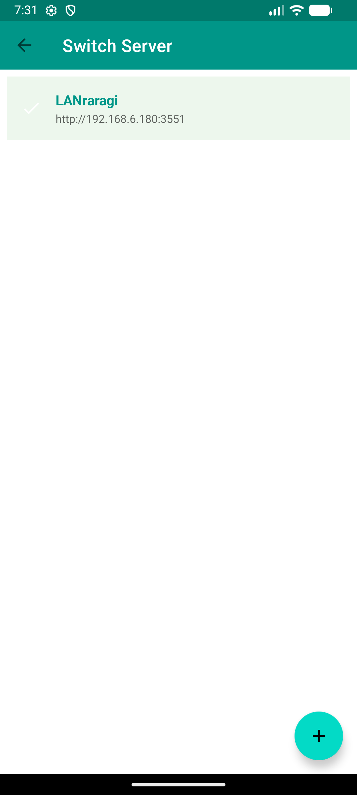

# LR Reader

[](LICENSE)
[](https://developer.android.com)
[](https://kotlinlang.org)

一个基于 EhViewer 阅读框架的 [LANraragi](https://github.com/Difegue/LANraragi) Android 客户端。

An Android client for [LANraragi](https://github.com/Difegue/LANraragi), built upon the EhViewer reading framework.

<p align="center">
  
  
  
  
</p>

---

## ✨ 功能特性 | Features

| 功能 / Feature | 说明 / Description |
|---|---|
| 🔍 **全功能搜索 / Full Search** | 关键词、分类筛选、排序、随机推荐 / Keywords, categories, sorting, random |
| 📖 **高性能阅读 / High-Performance Reader** | C 层图像解码引擎 + 智能预加载 / Native C image decoder + smart preloading |
| ⬇️ **离线下载 / Offline Download** | 后台下载整本档案，支持断点续传 / Background archive download with resume |
| 🏷️ **标签翻译 / Tag Translation** | 中文环境下自动翻译标签 / Auto-translate tags in Chinese locale (EhTagDatabase) |
| ⭐ **档案评分 / Archive Rating** | 基于标签的 emoji 星级评分 / Tag-based emoji star rating |
| 📁 **分类管理 / Category Management** | 浏览、创建、编辑 LANraragi 分类 / Browse, create, edit LANraragi categories |
| 🔐 **安全认证 / Secure Auth** | API Key 加密存储 + 定向请求鉴权 / Encrypted API Key storage + per-request auth |
| 🖥️ **多服务器 / Multi-Server** | 支持配置和切换多个 LANraragi 实例 / Configure and switch between server instances |
| 📤 **上传管理 / Upload** | 从设备上传档案 / 通过 URL 下载到服务器 / Upload from device or by URL |
| 🗑️ **远程删除 / Remote Delete** | 带倒计时确认的服务器档案删除 / Server-side archive deletion with countdown |
| 🌐 **10 种语言 / 10 Languages** | 中文简繁/粤语、日/韩/英/法/德/西/泰 / CJK + EN/FR/DE/ES/TH |
| 🌙 **深色模式 / Dark Mode** | 跟随系统主题，支持纯黑模式 / System theme + AMOLED black |

## 📥 下载 | Download

| 渠道 / Channel | 链接 / Link |
|---|---|
| GitHub Releases | [最新版本 / Latest](https://github.com/Xslx98/LRReader/releases) |

## 🛠️ 构建 | Build

### 环境要求 | Requirements

| 工具 / Tool | 版本 / Version |
|---|---|
| Android Studio | Ladybug+ |
| JDK | 21+ |
| Android SDK | API 35 (compileSdk) |
| Kotlin | 2.1.0 |
| Android 最低版本 / Min SDK | 9.0 (API 28) |

### 快速开始 | Quick Start

```bash
git clone https://github.com/Xslx98/LRReader.git
cd LRReader
```

首次 clone 后，在根目录创建 `local.properties` 并添加签名配置：

After cloning, create `local.properties` in the project root with your signing config:

```properties
sdk.dir=/path/to/your/Android/Sdk
RELEASE_STORE_FILE=keystore/release.jks
RELEASE_STORE_PASSWORD=REDACTED
RELEASE_KEY_ALIAS=lrreader
RELEASE_KEY_PASSWORD=REDACTED
```

构建 | Build:

```bash
# Debug APK
./gradlew :app:assembleAppReleaseDebug

# 签名 Release APK / Signed Release APK
./gradlew :app:assembleAppReleaseRelease
```

> 详细的签名配置和发布流程请参考 [CONTRIBUTING.md](CONTRIBUTING.md)。
>
> See [CONTRIBUTING.md](CONTRIBUTING.md) for detailed signing and release instructions.

## 🏗️ 技术栈 | Tech Stack

| 层 / Layer | 技术 / Technology |
|---|---|
| **语言 / Language** | Java / Kotlin hybrid |
| **网络 / Network** | OkHttp 4.12 + Kotlin Coroutines |
| **API 序列化 / Serialization** | kotlinx-serialization (LRR API) + Gson (legacy) |
| **数据库 / Database** | Room 2.6.1 + KSP (schema v9) |
| **图像解码 / Image Decoding** | Custom C/JNI engine (libjpeg-turbo, libpng, libwebp) |
| **安全 / Security** | EncryptedSharedPreferences (API Key) |
| **构建 / Build** | Gradle + R8/ProGuard |
| **ABI** | arm64-v8a, x86_64 |

## 📂 项目结构 | Project Structure

```
LRReader/
├── app/src/main/
│   ├── java/com/hippo/ehviewer/  # Main source (EhViewer framework)
│   │   ├── client/lrr/           # LANraragi REST API client
│   │   ├── dao/                  # Room Database (AppDatabase.kt)
│   │   ├── ui/                   # Activity & Fragment
│   │   └── Settings.java         # App preferences
│   ├── cpp/                      # C/JNI native image decoder
│   ├── res/                      # Resources (10 languages)
│   └── assets/                   # License pages
├── keystore/                     # Signing keys (gitignored)
├── CONTRIBUTING.md               # Contributing guide
├── PRIVACY_POLICY.md             # Privacy policy
├── NOTICE                        # Upstream credits
└── LICENSE                       # GPLv3
```

## 🙏 致谢 | Acknowledgments

本项目基于以下开源项目二次开发：

This project is built upon the following open-source projects:

| 项目 / Project | 作者 / Author | 许可证 / License |
|---|---|---|
| [EhViewer](https://github.com/seven332/EhViewer) | Hippo Seven | Apache 2.0 |
| [EhViewer_CN_SXJ](https://github.com/xiaojieonly/Ehviewer_CN_SXJ) | xiaojieonly (SXJ_LonelyDog) | GPLv3 |

### 依赖库 | Dependencies

- [AndroidX](https://developer.android.com/jetpack/androidx) (AppCompat, Room, RecyclerView, Security)
- [OkHttp](https://github.com/square/okhttp) - HTTP client
- [kotlinx-serialization](https://github.com/Kotlin/kotlinx.serialization) - JSON serialization
- [kotlinx-coroutines](https://github.com/Kotlin/kotlinx.coroutines) - Async programming
- [Gson](https://github.com/google/gson) - JSON parsing (legacy)
- [UCrop](https://github.com/Yalantis/uCrop) - Image cropping
- [ReLinker](https://github.com/KeepSafe/ReLinker) - Native library loading
- [jsoup](https://github.com/jhy/jsoup) - HTML parsing
- [libjpeg-turbo](https://libjpeg-turbo.org/) / [libpng](http://www.libpng.org/) - Native image decoding

完整开源许可信息请查看应用内 **设置 - 关于 - 许可证**。

Full license details available in-app under **Settings - About - License**.

## 📜 许可证 | License

本项目基于 [GNU General Public License v3.0](LICENSE) 发布。

This project is licensed under the [GNU General Public License v3.0](LICENSE).

原始 EhViewer 代码基于 [Apache License 2.0](https://www.apache.org/licenses/LICENSE-2.0)。详见 [NOTICE](NOTICE)。

Original EhViewer code is licensed under [Apache License 2.0](https://www.apache.org/licenses/LICENSE-2.0). See [NOTICE](NOTICE).
