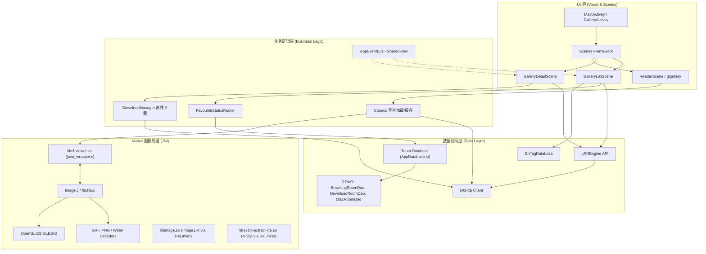

# LRReader 项目技术文档与架构指南

> 最后更新：2026-03-25  
> 当前版本：v1.9.0 (versionCode 12)

> [!TIP]
> **相关文档**：[onboard.md](onboard.md)（入门指南）| [PROJECT_TECHNICAL_SUMMARY.md](PROJECT_TECHNICAL_SUMMARY.md)（深度技术评估）| [EDGE_TO_EDGE.md](EDGE_TO_EDGE.md)（状态栏适配）| [CONTRIBUTING.md](../CONTRIBUTING.md)（签名配置 & 构建命令）

## 1. 项目概述

**LRReader** (基于原 EhViewer 架构二次开发/重构) 是一款专为与 [LANraragi](https://github.com/Difegue/LANraragi) 服务器交互而设计的 Android 客户端。应用支持连接私有 LANraragi 实例进行漫画/画廊的搜索、在线阅读、元数据管理及本地离线下载。

该项目采用混合语言开发，结合了 Java、Kotlin 以及用于高性能图像处理的 C/C++ (JNI)。

## 2. 构建配置

项目为单模块结构（`:app`），`daogenerator` 模块已在 GreenDAO→Room 迁移中移除。

**核心技术栈与依赖库：**
*   **构建工具 & 语言**：Android SDK (Min 28 / Target 35), Java 21, Kotlin 2.1.0, KSP `2.1.0-1.0.29`, CMake 3.18.1+
*   **构建插件**：`com.google.devtools.ksp`（注解处理）, `org.jetbrains.kotlin.plugin.serialization`（JSON 序列化）
*   **基础 UI 与架构**：
    *   `androidx.appcompat:appcompat:1.7.0`
    *   `com.google.android.material:material:1.13.0`
    *   `androidx.fragment:fragment:1.8.6`
    *   `androidx.recyclerview:recyclerview:1.4.0`
    *   `androidx.preference:preference-ktx:1.2.1`
*   **异步与并发**：
    *   `org.jetbrains.kotlinx:kotlinx-coroutines-android:1.10.2` (Kotlin 协程)
    *   `androidx.lifecycle:lifecycle-runtime-ktx:2.8.7`
    *   `AppEventBus.kt`（`MutableSharedFlow(replay=1)` — 替代已移除的 EventBus）
*   **网络通信**：
    *   `com.squareup.okhttp3:okhttp:4.12.0` (及 `okhttp-dnsoverhttps`)
    *   `com.github.xiaojieonly:Android-Request-Inspector-WebView:70403bb`
*   **数据解析**：
    *   `org.jetbrains.kotlinx:kotlinx-serialization-json:1.8.1` (LANraragi API 主要序列化)
    *   `com.google.code.gson:gson:2.11.0` (部分旧代码仍在使用)
    *   `org.jsoup:jsoup:1.18.1` (HTML 解析)
    *   `FlexibleStringSerializer`（自定义，处理 API 返回的 boolean/int/string 类型变异）
*   **本地存储**：
    *   `androidx.room:room-runtime:2.6.1` + `room-ktx` (已完全替代 GreenDAO)
    *   `ksp "androidx.room:room-compiler:2.6.1"` (注解处理器)
    *   `androidx.security:security-crypto:1.1.0-alpha06`
*   **解压与文件处理**：
    *   `com.github.xiaojieonly.a7zip_XJ:extract-lite:1.0.3` (处理压缩包，通过 JNI)
*   **图像渲染与 JNI**：
    *   原作者 `seven332` 的 `glgallery`, `glview`, `image` 库 (OpenGL 加速画廊视图)
    *   `com.fpliu.ndk.pkg.prefab.android.21:libpng:1.6.37`
    *   `com.getkeepsafe.relinker:relinker:1.4.4` (安全加载 Native SO 库)
*   **自定义 UI 组件 (Legacy)**：
    *   `com.github.seven332:*` 系列 (如 `easyrecyclerview`, `refreshlayout`, `drawerlayout`)

### R8 / ProGuard 配置

`proguard-rules.pro` 配置了 `-dontobfuscate`（仅 tree-shaking，不混淆），并为以下类添加了 `-keep` 规则：

| 类别 | 保护范围 |
|------|---------|
| JNI / Native | `com.hippo.a7zip.**`, `Image1`, `ReLinker`, `Native`, `GifHandler` |
| Room DAO | `com.hippo.ehviewer.dao.**` |
| 序列化模型 | `com.hippo.ehviewer.client.lrr.data.**`, `com.hippo.ehviewer.client.data.**` |
| XML 引用 | `widget.**`, `preference.**` |
| 反射实例化 | `ui.fragment.**`（Settings PreferenceFragment）, `ui.scene.**`（StageLayout Scene） |

---

## 3. 完整架构图

---

## 4. 核心系统解析

### 4.1 页面导航系统 (Scenes Framework)
项目没有采用传统的基于 Fragment 或 Activity 的导航，而是大量使用了自定义的 `Scene` 框架（如 `BaseScene`, `GalleryListScene` 等）。这种架构旨在提供更轻量级的视图切换和更精细的生命周期控制。Scene 类通过 `StageLayout` 以反射方式实例化（因此需要 ProGuard `-keep` 规则）。

### 4.2 网络引擎 (LRREngine)
`LRREngine.kt` 是与 LANraragi 服务器通信的核心单例。
*   基于 **Kotlin Coroutines (`suspend` functions)** 运行在 `Dispatchers.IO`。
*   使用 **kotlinx-serialization** 进行 JSON 反序列化（`LRRArchive`, `LRRCategory`, `LRRSearchResult`, `LRRServerInfo`）。
*   `FlexibleStringSerializer` 处理 `isnew`（可能是 boolean/string）和 `pinned`（可能是 int/string）等 API 类型变异。
*   使用 `LRRAuthInterceptor` 拦截器安全地将 API Key 注入为 Bearer Token，并严格校验目标 Host 以防止 Token 泄漏。

### 4.3 高性能图像渲染 (Native & OpenGL)
为了在低端设备上也能流畅浏览极高分辨率的图片或漫画长图，应用在 Native 层实现了图片解码与渲染：
*   **JNI 入口**：`java_wrapper.c` 桥接了 Kotlin 层的 `Image1` 类。
*   **硬件加速**：利用 `GLESv2` (OpenGL ES) 实现纹理贴图 (`glTexImage2D`)。
*   **流式处理**：通过自定义 `InputStream` 和 `fdutils` 绕过 Java 堆内存限制，直接在 Native 堆进行大图分块加载 (`tile_buffer`) 和解码 (GIF/PNG 等)。
*   **双引擎并存**：`Image1.kt`（旧版 Native JNI 包装）和 `Image.kt`（现代 `ImageDecoder` 包装）同时存在，长期目标是统一到 `Image.kt`。

### 4.4 数据持久化 (Room + 异步 DAO)
持久化层已完全迁移至 AndroidX Room，DAO 全面异步化：
*   **`AppDatabase.kt`**：单例 `RoomDatabase`，管理 11 张表。已移除 `allowMainThreadQueries()`。
*   **3 个 DAO**：`BrowsingRoomDao`（历史/收藏/快捷搜索/过滤器）、`DownloadRoomDao`（下载信息/标签/目录名）、`MiscRoomDao`（黑名单/画廊标签/书签）。**全部方法均为 `suspend`**。
*   **`EhDB.kt`**：~1170 行双层桥接 API——`suspend` 方法供 Kotlin 协程直接调用，`@JvmStatic runBlocking` 桥接方法供 21+ 个 Java 调用方使用。
*   **`LRRCoroutineHelper.kt`**：`runSuspend()` 顶级函数封装 `kotlinx.coroutines.runBlocking`，消除 22 处 Java 调用 suspend 函数的样板代码。
*   **Entity 兼容**：所有 Entity 使用 `@ColumnInfo(name = "UPPERCASE")` 保持与旧 GreenDAO 大写列名兼容。

> **⚠️ 数据库 Migration 指南**
>
> v9 是首个公开发布版本（baseline）。未来修改数据库结构时：
> 1. 修改 Entity（增删改字段/表）
> 2. `AppDatabase` 的 `version` 加 1
> 3. 编写 `Migration(旧版, 新版)` 对象，包含 `ALTER TABLE` / `CREATE TABLE` SQL
> 4. 在 `databaseBuilder` 中注册 `.addMigrations(...)`
>
> Room 自动链式执行所需 Migration（如 v9→v11 = 9_10 + 10_11），用户数据完整保留。
> **严禁使用 `fallbackToDestructiveMigration()`，否则用户数据丢失。**

### 4.5 事件系统 (AppEventBus)
已从 greenrobot EventBus 完全迁移至 Kotlin `SharedFlow`：
*   `AppEventBus.kt`：`MutableSharedFlow(replay=1)` 实现 sticky 语义。
*   用于跨组件通信（如收藏状态变更、下载进度通知）。

## 5. 编译与构建指南

1.  **环境要求**：
    *   Android Studio Ladybug (或更高版本)
    *   JDK 21
    *   Android NDK 和 CMake `3.18.1+`，用于编译 `ehviewer` 动态链接库
2.  **签名配置**：项目使用 `keystore/release.jks` 签名，凭据通过 `local.properties` 注入。详见 [CONTRIBUTING.md](../CONTRIBUTING.md#签名配置)
3.  **构建命令**：
    *   Debug：`.\gradlew.bat assembleAppReleaseDebug`
    *   签名 Release APK：`.\gradlew.bat assembleAppReleaseRelease`
    *   AAB (Google Play)：`.\gradlew.bat bundleAppReleaseRelease`
4.  **注解处理**：使用 KSP（非 kapt）处理 Room 注解，构建速度更快

## 6. 已知技术债与改进方向

### 仍需处理

1.  **Image 双引擎**：`Image1.kt`（旧 Native）和 `Image.kt`（新 ImageDecoder）并存，长期应统一。
2.  **命名空间混叠**：包名 `com.hippo.ehviewer` 保留旧框架痕迹，但经评估（501 文件 + 50+ JNI 函数名硬编码）重命名 ROI 极度负面，`applicationId` 已是 `com.lanraragi.reader`，决定保持现状。

### 已解决

- ~~fastjson 依赖~~ → 已替换为 kotlinx-serialization
- ~~GreenDAO / daogenerator~~ → 已替换为 Room + KSP
- ~~kapt 插件~~ → 已替换为 KSP
- ~~EventBus 依赖~~ → 已替换为 SharedFlow
- ~~R8 release 构建崩溃~~ → ProGuard 规则已完善
- ~~kotlinx-serialization 类型不匹配~~ → FlexibleStringSerializer 已修复
- ~~Native 并发安全~~ → `Image1.kt` `mNativePtr` 改为 `AtomicLong`，`tile_buffer` 确认仅 GL 线程访问
- ~~SSL 证书校验~~ → 域前置代码已删除，OkHttp 使用平台默认证书链
- ~~死代码资源~~ → `scene_login.xml`、`requestOverride.js`、`TestThread.java` 已删除
- ~~Scoped Storage~~ → 已迁移至 `context.getExternalFilesDir()` + MediaStore + SAF
- ~~主线程数据库访问~~ → Room DAO 全部 `suspend`，`allowMainThreadQueries()` 已移除
- ~~异步桥接样板~~ → `LRRCoroutineHelper.runSuspend()` 消除 22 处样板代码
- ~~图像格式缺失~~ → 新增 AVIF + JPEG XL 支持
- ~~缓存淘汰精度~~ → SharedPreferences 时间戳替代 `lastModified()`
